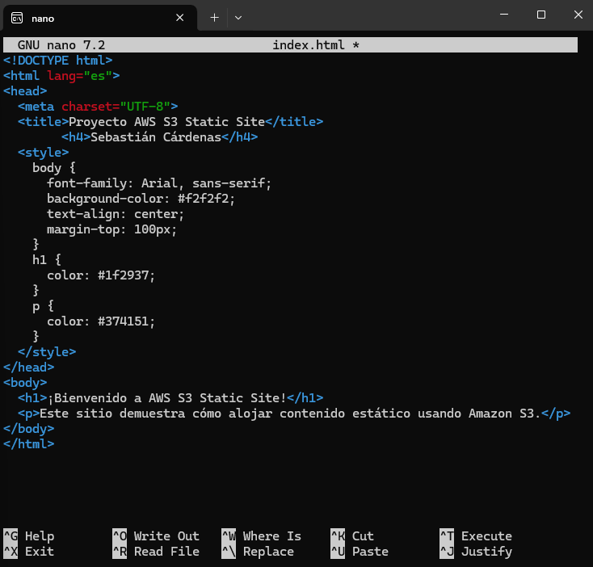
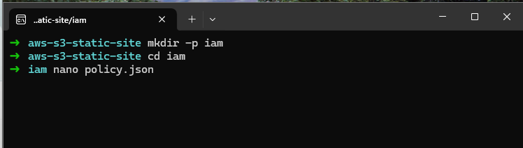

# 🌐 AWS S3 Static Site

This project demonstrates how to deploy a static website using **Amazon S3** and the **AWS CLI**, configuring public access via IAM policies. It is part of my learning path as an **AWS Cloud Practitioner**.

---

## 🔧 Services and Tools Used

- **Amazon S3** – Static file storage and web hosting
- **AWS CLI** – Command-line tool for managing AWS resources
- **IAM Policies** – JSON-based access control configuration
- **Linux/WSL** – Local development environment (Ubuntu)
- **Git + GitHub** – Version control and public repository

---

## 📁 Project Structure

```plaintext
aws-s3-static-site/
├── web/
│   └── index.html
├── iam/
│   └── policy.json
├── screenshots/
│   └── (process screenshots)
└── README.md
```
---

## 🚀 Steps Performed

1. Create project folder and initial structure
2. Write a custom index.html file
3. Create an S3 bucket with a dynamic name
4. Enable static website hosting on the bucket
5. Upload the HTML file using aws s3 cp
6. Create and apply a public access policy (policy.json)
7. Disable default public access blocking in the AWS console
8. Access and test the site in the browser
9. Document all steps with screenshots and publish to GitHub

---

## 📸 Process Screenshots

### 1️⃣ Project structure created


### 2️⃣ Custom HTML file edited


### 3️⃣ S3 bucket created via AWS CLI


### 4️⃣ IAM policy file created



### 5️⃣ Hosting activated and file uploaded


### 6️⃣ File verification in the S3 bucket


### 7️⃣ Apply bucket policy using CLI


### 8️⃣ Public access block successfully disabled


### 9️⃣ Manual public access unblock in AWS console


### 🔟 Final working website from S3 public URL


---

## 🌍 Deployed Site URL

🔗 [`http://aws-static-site-1746951788.s3-website-us-east-1.amazonaws.com`](http://aws-static-site-1746951788.s3-website-us-east-1.amazonaws.com)

---

## 👤 Author

**Sebastián Cárdenas**  
*AWS Cloud Practitioner in training*

📫 Contact: [sebastian.cardenas.t@gmail.com](mailto:sebastian.cardenas.t@gmail.com)

---

## ✅ Outcome

This repository documents a fully functional static site deployment on AWS S3 using CLI and is part of my technical portfolio.
