# 🌐 AWS S3 Static Site

Este proyecto demuestra cómo desplegar un sitio web estático utilizando **Amazon S3** y **AWS CLI**, configurando permisos públicos mediante políticas IAM. Forma parte de mi ruta de aprendizaje como **AWS Cloud Practitioner**.

---

## 🔧 Servicios y herramientas utilizadas

- **Amazon S3** – Almacenamiento de archivos estáticos y hosting web
- **AWS CLI** – Línea de comandos para gestionar recursos en AWS
- **IAM Policy** – Control de acceso mediante políticas JSON
- **Linux/WSL** – Entorno de desarrollo local en Ubuntu
- **Git + GitHub** – Control de versiones y publicación del proyecto

---

## 📁 Estructura del proyecto

```plaintext
aws-s3-static-site/
├── web/
│   └── index.html
├── iam/
│   └── policy.json
├── screenshots/
│   └── (capturas del proceso)
└── README.md
```
---

## 🚀 Pasos realizados

1. Crear carpeta del proyecto y estructura inicial
2. Escribir un archivo `index.html` con HTML personalizado
3. Crear bucket en S3 con un nombre dinámico
4. Activar el hosting estático en el bucket
5. Subir el archivo `index.html` con `aws s3 cp`
6. Crear y aplicar una política pública (`policy.json`)
7. Desactivar el bloqueo de acceso público desde la consola AWS
8. Comprobar acceso web desde navegador
9. Documentar todo el proceso con capturas y subir a GitHub

---

## 📸 Capturas del proceso completo

### 1️⃣ Estructura del proyecto creada
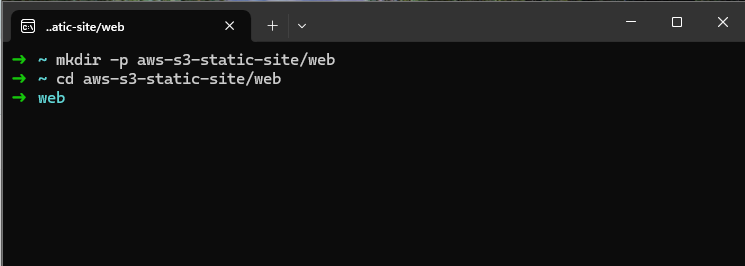

### 2️⃣ Archivo HTML editado con contenido personalizado
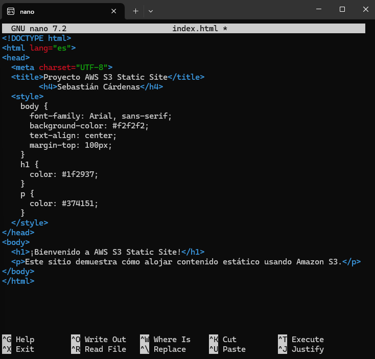

### 3️⃣ Bucket S3 creado desde AWS CLI
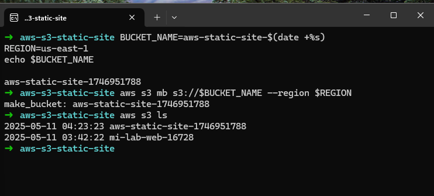

### 4️⃣ Creación del archivo de política IAM
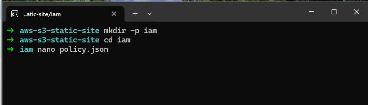
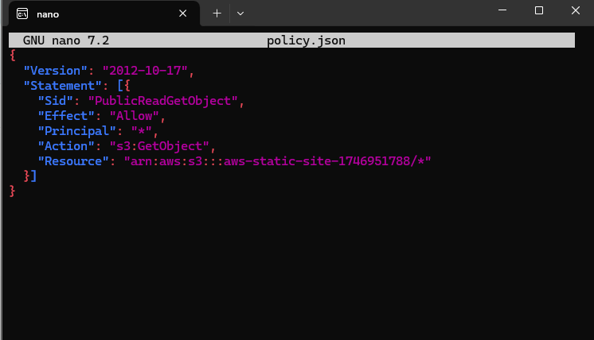

### 5️⃣ Hosting activado y archivo subido correctamente
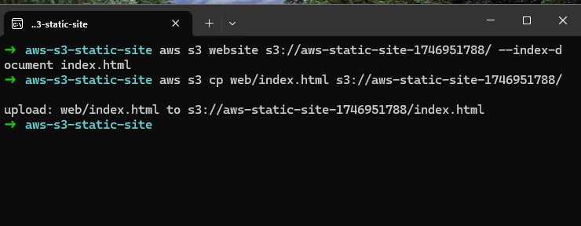

### 6️⃣ Verificación del archivo en el bucket S3
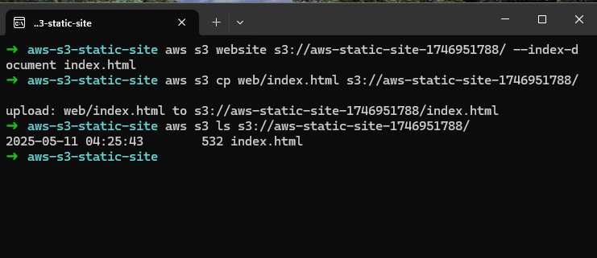

### 7️⃣ Aplicar política pública al bucket desde terminal
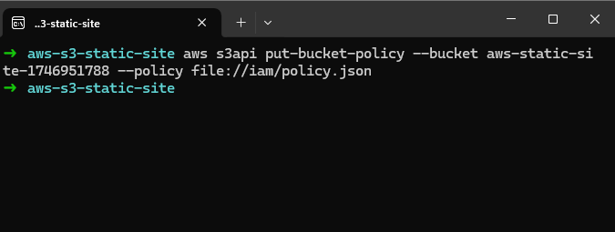

### 8️⃣ Confirmación visual: bloqueo público desactivado
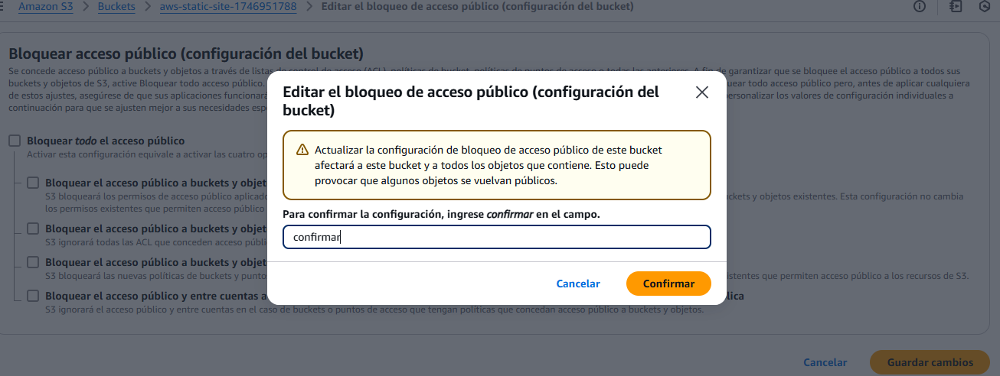

### 9️⃣ Edición manual del bloqueo desde consola de AWS
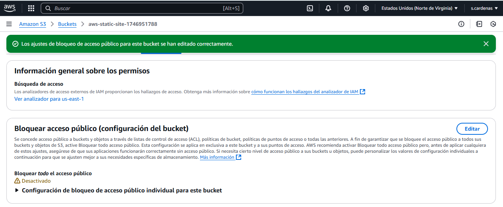

### 🔟 Sitio web funcionando desde URL pública de S3
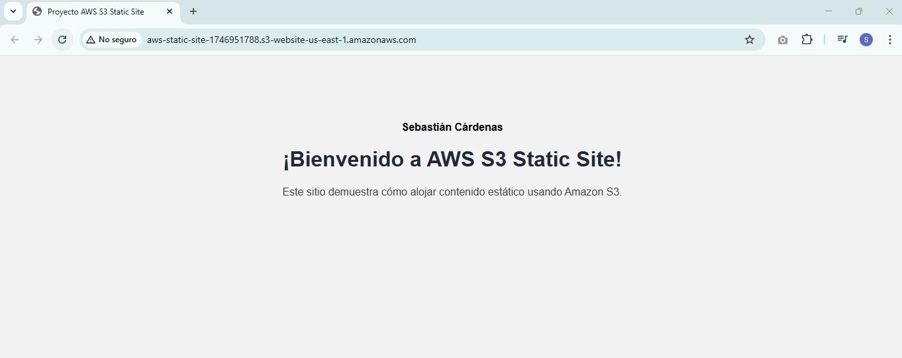

---

## 🌍 URL del sitio desplegado

🔗 [`http://aws-static-site-1746951788.s3-website-us-east-1.amazonaws.com`](http://aws-static-site-1746951788.s3-website-us-east-1.amazonaws.com)

⚠️ Por motivos de seguridad, el bucket ya fue cerrado.

---

## 👤 Autor

**Sebastián Cárdenas**  
*Aspirante a AWS Cloud Practitioner | Analista Programador*

📫 Contacto: [sebastian.cardenas.t@gmail.com](mailto:sebastian.cardenas.t@gmail.com)

---

## ✅ Resultado

Repositorio funcional, documentado, versionado en Git y publicado como parte de mi portafolio técnico.


